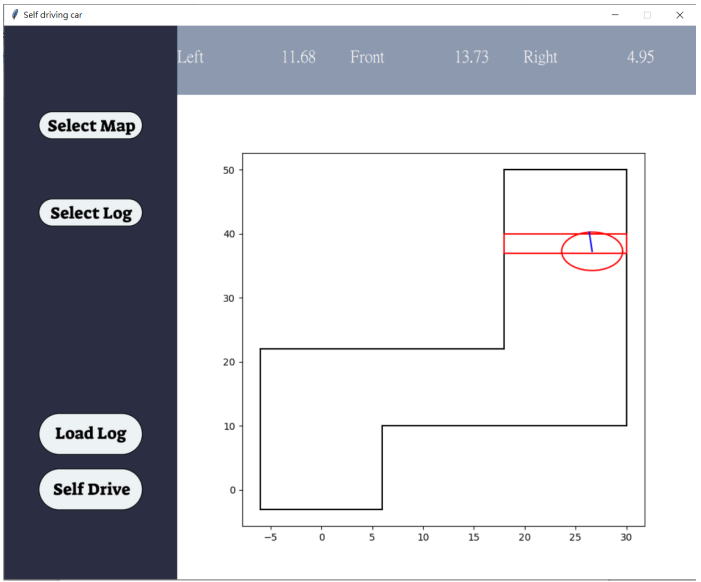

# 使用說明
執行gui.exe
## 程式介面說明

- Select Map：讀取軌道
- Select Log：選擇行進路徑記錄檔(如果是要看模型訓練結果就不用選)
- Load Log：讓自走車根據紀錄檔中的路徑行走
- Self Drive：載入 MLP 模型，將左、前、右 3 個測距 sensor 測得的距離當 作模型輸入所得的結果
- 上方的 Left、right、front：sensor 所測到的車子與牆壁距離
- 右下方的 figure：自駕結果
### 如何重現實驗結果
點擊 select map -> 選取軌道座標點txt檔 -> 點擊 self-drive

# 程式碼說明
- GUI.py：包含 GUI 物件設定(layout)與 GUI 上各個按鈕按了之後呼叫函式的邏輯
- Car_and_Map.py: 定義 Car 與 Map 這兩個 class。
    - Map 提供讀取地圖後將地圖繪製於 GUI 上的功能(包含將車子的初始位置也 一起繪製)，Map 中也會儲存與地圖邊界相關的資訊。 
    - Car 提供車子移動後的座標與面向更新、根據車子位置更新三個 sensor 的值、偵測車子是否撞到邊界、將車子繪製在 figure 上、判斷車子是否到達終點、將車子位置重置等功能。
- Dataset.py: 就像是 pytorch 裡的 dataset 一樣，做一些資料的前處理，讓資料可以送入模型訓練。
- Model.py: 定義模型與儲存、載入模型
- Class MLP
    - __init__: 根據傳入的參數，初始化權重、配置空間暫存每個神經元的輸出結果、配置空間儲存每一個神經元的 delta(區域梯度函數)和設定 activation function(目前只有 sigmoid 可用)
    - Forward: 傳入訓練資料，計算每一個神經元的輸出並儲存
    - Backward: 計算各個神經元的區域梯度函數並儲存
    - Derivative_of_activation_function: 根據活化函數的不同，計算微分後的結果
    - Update: 更新權重
- Generate_training_data.py: 一個 GUI 介面，用來生成訓練資料，方式包含手動開車、用訓練的不是很好的模型開車、根據觀察出來的規則開車
- Train_Model.py: 訓練模型(可以自由更改模型層數和 learning rate)，訓練後的模型存在 model 資料夾下